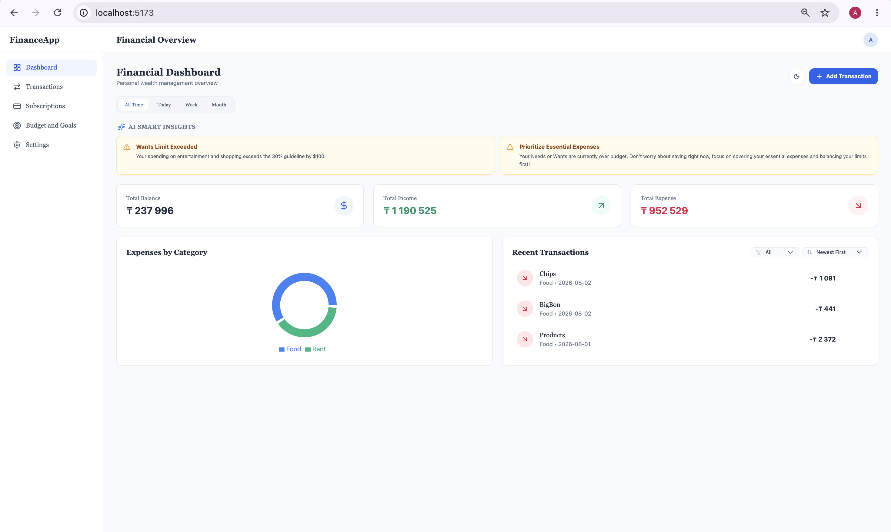
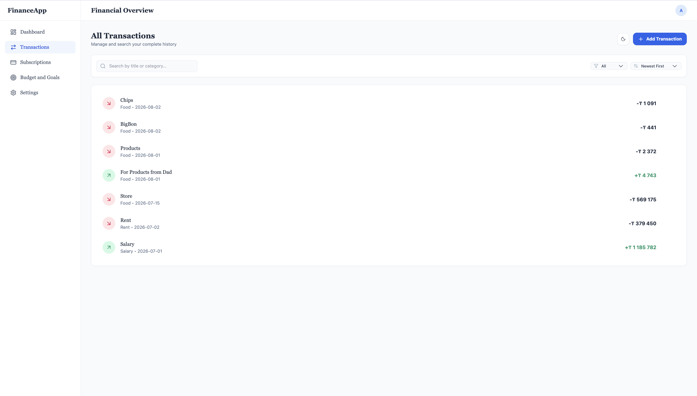
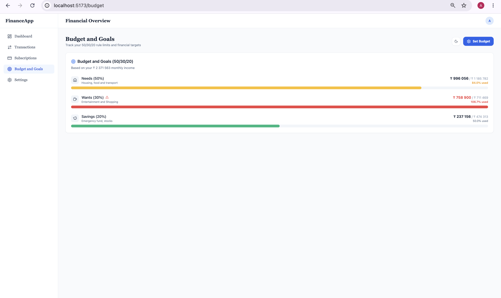
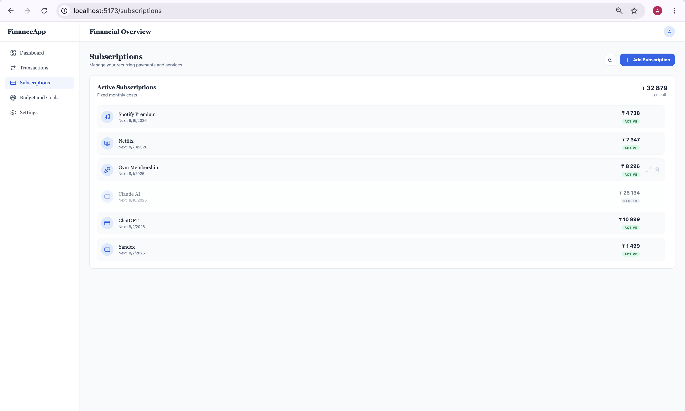
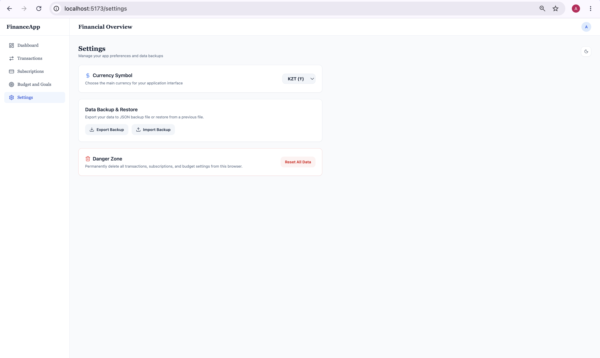
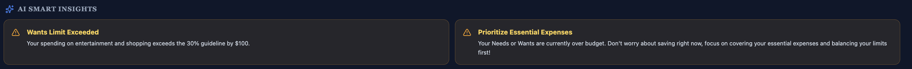
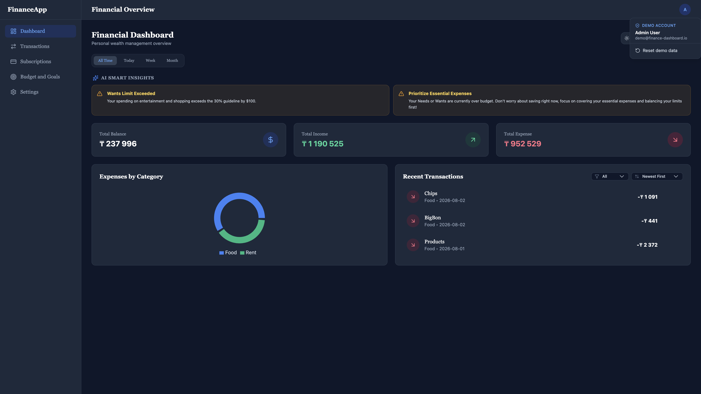

# 💰 Finance Dashboard

A modern personal finance dashboard built with **React**, **TypeScript**, and **Tailwind CSS**.

Track your income and expenses, manage budgets, monitor subscriptions, analyze spending with interactive charts, and receive smart financial insights — all in one responsive dashboard.

---

## 📸 Preview

### Dashboard


### Transactions


### Budget Management


### Subscriptions


### Settings


### Smart Insights


### Dark Mode


---

# ✨ Features

## 📊 Dashboard

- Financial overview
- Total balance
- Monthly income
- Monthly expenses
- Savings tracking
- Interactive analytics

---

## 💸 Transaction Management

- Add transactions
- Edit transactions
- Delete transactions
- Income & Expense types
- Category management
- Currency support
- Date selection

---

## 📈 Analytics

- Expense distribution (Pie Chart)
- Income vs Expense trends
- Monthly statistics
- Time range filters
- Smart financial insights

---

## 🎯 Budget Management

- Category budgets
- Budget progress tracking
- 80% warning indicator
- Overspending detection
- Financial goals

---

## 🔁 Subscription Tracker

Manage recurring payments like:

- Spotify
- Netflix
- Gym
- Internet
- Mobile
- Other subscriptions

Includes:

- Monthly cost
- Next payment date
- Active subscriptions overview

---

## ⚙️ Settings

Customize your dashboard experience:

- Dark / Light theme
- Reset all application data
- Clear LocalStorage
- Confirmation dialogs
- User preferences

---

## 🌙 User Experience

- Responsive design
- Dark / Light mode
- Modern UI
- Mobile friendly
- Clean component architecture

---

# 📂 Project Structure

```
src/
│
├── components/
├── pages/
├── hooks/
├── types/
├── utils/
├── data/
├── constants/
├── assets/
└── App.tsx
```

---

# ⚙️ Installation

Clone the repository

```bash
git clone https://github.com/ga1ssaa/finance-dashboard.git
```

Go to project

```bash
cd finance-dashboard
```

Install dependencies

```bash
npm install
```

Run development server

```bash
npm run dev
```

Build production version

```bash
npm run build
```

---

# 📱 Responsive Design

The application is optimized for

- 💻 Desktop
- 📱 Mobile
- 📟 Tablet

---

# 🧠 Project Highlights

- Modular architecture
- Reusable components
- Custom React Hooks
- Strong TypeScript typing
- Responsive layout
- Interactive charts
- Local persistence
- Clean UI/UX
- Feature-based organization

---

# 🚀 Future Improvements

- Authentication
- Backend integration
- Cloud database
- Multi-currency support
- Export to PDF
- CSV import/export
- Notifications
- Recurring transactions
- AI financial recommendations

---

# 📄 License

This project is licensed under the MIT License.

---

# 👨‍💻 Author

**Gaisa Aldiyar**

Software Engineering Student

Astana IT University

GitHub:
https://github.com/ga1ssaa